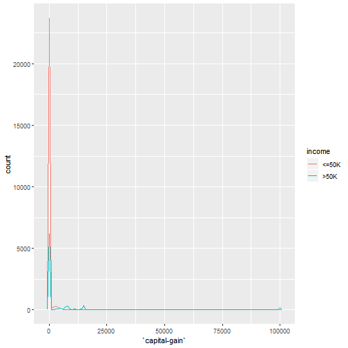
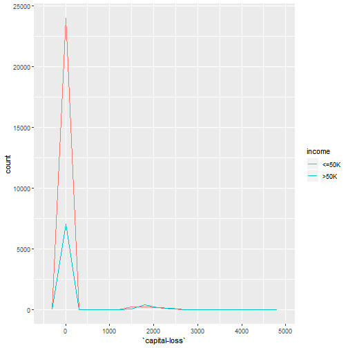
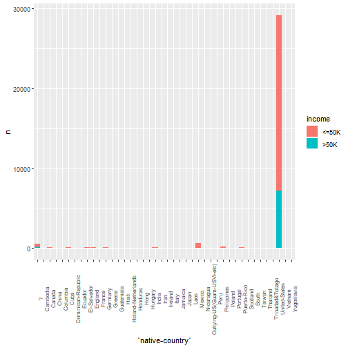
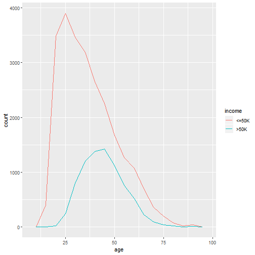
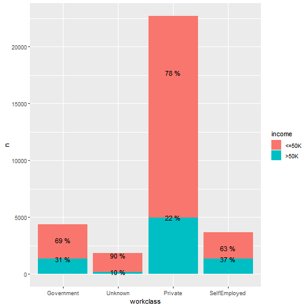
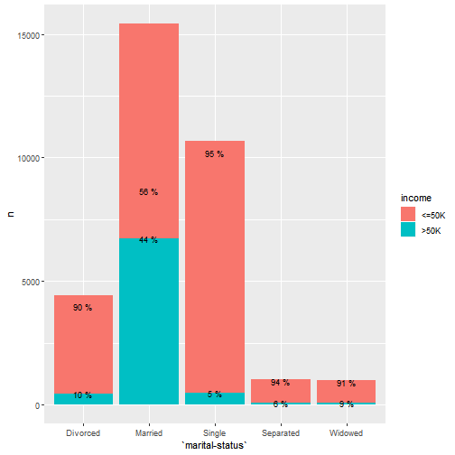
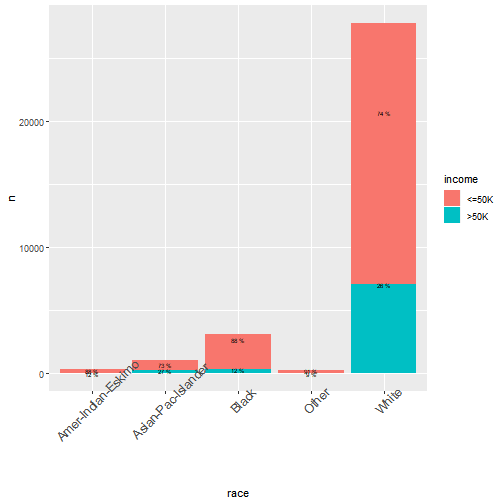
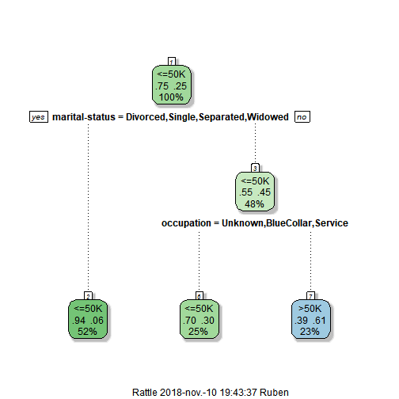

---
output:
  word_document:
    highlight: zenburn
    reference_docx: word-styles-reference-27.docx
  pdf_document: default
---


# Format d´entrega 

Aquest document s´ha realitzat mitjançant __Markdown__[^1] amb l´ajuda de l´entorn de desenvolupament __RStudio__[^2] utilitzant les característiques que aquest ofereix per
a la creació de documents __R__ reproduïbles.

La documentació generada en la realització de la pràctica  es troba allotjada en __GitHub__ al següent repositori:

* https://github.com/rsanchezs/data-minig

En aquest repositori es poden trobar els següents fitxers:

* Aquest document en formats __pdf__ i __docx__ amb el nom rsanchezs_PAC2.
* Un document __R Markdown__[^3] que es pot utilitzar per a reproduir tots els exemples
presentats a la PAC.
* El conjunt de dades utilitzades.


[^1]: https://es.wikipedia.org/wiki/Markdown
[^2]: https://www.rstudio.com/
[^3]: https://rmarkdown.rstudio.com/


# Exercici 1

Contextualitzeu els exemples de les següents preguntes respecte al projecte que heu definit a la PAC1. Si ho desitgeu, podeu redefinir o canviar apartats del projecte.

a) Creieu que els arbres de decisió són el mètode més adequat per aconseguir els objectius que us havíeu proposat? Justifiqueu la resposta tot raonant-la.

En relació amb el cas pràctic que vaig desenvolupar a la PAC1 es tractava d´implementar
un _recommender system_ (de l´anglès, sistemes de recomanació). És per això que, utilitzar
els arbres de decisió no sería un bona elecció.

En canvi, l´algoritme _Nearest Neighborhood_ (de l´anglès, algoritme del veí més proper), és el 
més utilitzat avui dia en els sistemes de recomanació.


b) Com podria ser l’arbre resultant?

En aquest apartat ens proposem d´exposar un exemple simple de classificació d´arbres
de decisió. Suposem que tenim un problema, on ens interessa un model que classifiqui
sol·licituds de préstecs hipotecaris entre les classes __Aprovat__ i __Rebutjat__.

A continuació, es mostra una taula amb el conjunt de dades. Cal recordar que es tracta
d'un conjunt d´entrenament, on l'última columna conté la classe a què pertany
cada observació:


Les variables en aquest exemple són `Client`, que ens indica si una sol·licitud de crèdit es demana per un client del banc; la variable `Ingrés`, expressa el nivell d´ingressos de la persona que sol·licita el préstec; i la variable `Historial`, manifesta el comportament creditici del client en el passat.

Per il·lustrar, a continuació es mostra un arbre de decisió que en podria ser un exemple de resolució del nostre problema:


Passem a analitzar l´arbre de decisió de la figura 2. Els nodes blaus són els nodes interns i els nodes de color roig i verds són les fulles de l´arbre. En general, cada node intern d´un arbre
de decisió representa una variable (o atribut) en el nostre conjunt de dades. Per exemple, el node
__Client__, fa referència a la variable `Client` que correspon a la primera columna del nostre conjunt de dades (vegeu figura 1).

Cada branca que surt dels nodes representa cada un dels possibles valors que pot prendre el node. Per exemple, el node que fa referencia a la variable `Historial` pot pendre els valos __Bo__ ó __Dolent__.

Cada node realitza una pregunta basada en els valors que l'atribut pot suportar i, depenent
d´aquest resultat l´arbre ens indica el camí a seguir. En el cas concret del node __Historial__ realitza la pregunta si el valor de la variable és bo o dolent. Si és bo, el recorregut per l´arbre continua per l'esquerra; altrament continua per la dreta.

Les fulles corresponen al resultat final de la classificació generada per l´arbre de decisió. En aquest sentit, si una dada arriba a la primera fulla verda de l'esquerra, significa que la classificació de la dada es __Aprovat__.

Per posar un exemple de com classificar una nova data, suposem que la data és una persona que
és client, té un bon historial i ingressos alts. A la figura 3 es mostra el recorregut per l'arbre:


# Exercici 2

Repetiu l’exercici 2 amb algun altre conjunt de dades. Poden ser dades reals del vostre àmbit laboral o d’algun repositori de dades a Internet. Mireu per exemple: http://www.ics.uci.edu/~mlearn/MLSummary.html o d`altres repositoris ja citats Seguiu el guió proposat a la pregunta anterior. Podeu afegir nous punts com ampliació de la resposta (per exemple provar la validació creuada, el boosting, variar el prunning o provar una altra mena d’arbre…) Recordeu també que el cicle de vida dels projectes de mineria contempla retrocedir per tornar a generar el model amb dades modificades o paràmetres de l’algorisme variats si el resultat no és prou bo.


## Introducció

A partir del joc de dades disponible en el següent enllaç: http://archive.ics.uci.edu/ml/datasets/Adult realitzarem els passos del cicle de vida
d´un projecte de mineria de dades per al cas d´un algorisme de classificació i més
concretament un arbre de decisió.


## Carrega i exàmen preliminar del conjunt de dades

En primer lloc, instal.larem el paquet `readr`[^8] que forma part del ecosistema `tidyverse`[^9] i que ens permetrà llegir les dades:


```r
# La forma més sencilla de instal.lar readr es instal.lar tidyverse
install.packages("tidyverse")

# Alternativament, podem instal.lar només readr
install.packages("readr")
```

Un cop instal.lat el paquet el carregarem a la sessió R mitjançant la següent línia de codi:


```r
# Carrega de readr
library(readr)

# Alternativament, com que forma part de tidyverse
library(tidyverse)
```

Observem que, hem fet ús de la segona opció que carrega tots els paquets de `tidyverse`,
ja que utilitzarem per a la realització de la pràctica altres paquets, com per exemple:
`dplyr` (per a la transformació de dades),`tibble` (per a un tractament més refinat de
`data.frames`), `ggplot2` (per a la visualització de les dades), etc.


Un cop carregat el paquet a la sessió R, ja podem fer ús de les funcions. Per a importar
les dades des de l´adreça utilitzarem la funció `read_csv()`:


```r
# Llegim les dades
adult <- read_csv("http://archive.ics.uci.edu/ml/machine-learning-databases/adult/adult.data")
```


Convertim el conjunt de dades `adult` que és del tipus `data.frame` a `tibble`:


```r
# Convertim el dataframe a tibble
as_tibble(adult)
```

```
## # A tibble: 32,560 x 15
##     `39` `State-gov` `77516` Bachelors  `13` `Never-married` `Adm-clerical`
##    <int> <chr>         <int> <chr>     <int> <chr>           <chr>         
##  1    50 Self-emp-n~   83311 Bachelors    13 Married-civ-sp~ Exec-manageri~
##  2    38 Private      215646 HS-grad       9 Divorced        Handlers-clea~
##  3    53 Private      234721 11th          7 Married-civ-sp~ Handlers-clea~
##  4    28 Private      338409 Bachelors    13 Married-civ-sp~ Prof-specialty
##  5    37 Private      284582 Masters      14 Married-civ-sp~ Exec-manageri~
##  6    49 Private      160187 9th           5 Married-spouse~ Other-service 
##  7    52 Self-emp-n~  209642 HS-grad       9 Married-civ-sp~ Exec-manageri~
##  8    31 Private       45781 Masters      14 Never-married   Prof-specialty
##  9    42 Private      159449 Bachelors    13 Married-civ-sp~ Exec-manageri~
## 10    37 Private      280464 Some-col~    10 Married-civ-sp~ Exec-manageri~
## # ... with 32,550 more rows, and 8 more variables: `Not-in-family` <chr>,
## #   White <chr>, Male <chr>, `2174` <int>, `0` <int>, `40` <int>,
## #   `United-States` <chr>, `<=50K` <chr>
```

Podem adonar-nos que, el conjunt de dades està format per 32.560 observacions i 15 variables. A més, amb l´ajuda de `tibble` també podem observar el tipus per a cada columna.


Com que el nom de les columnes es poc descriptiu per alguns dels atributs, personalitzarem
els noms mitjançant la següent línia de codi:


```r
# Noms dels atributs
names(adult) <- c("age","workclass","fnlwgt","education","education-num","marital-status","occupation","relationship","race","sex","capital-gain","capital-loss","hour-per-week","native-country","income")
```

Podem comprovar el nom de les columnes mitjançant la funció `colnames`:


```r
# Comprovem es nom de les columnes
colnames(adult)
```

```
##  [1] "age"            "workclass"      "fnlwgt"         "education"     
##  [5] "education-num"  "marital-status" "occupation"     "relationship"  
##  [9] "race"           "sex"            "capital-gain"   "capital-loss"  
## [13] "hour-per-week"  "native-country" "income"
```


[^8]: Paquet per a la lectura de dades amb format rectangular: https://readr.tidyverse.org/
[^9]: Conjunt de paquets R per a la Ciència de les Dades :https://www.tidyverse.org/


## Exploració i tractament de valors desconeguts


En tercer lloc, ens caldria comprovar que el nostre conjunt de dades no conté valors
desconeguts:


```r
# Estadístiques de valors buits.
colSums(is.na(adult))
```

```
##            age      workclass         fnlwgt      education  education-num 
##              0              0              0              0              0 
## marital-status     occupation   relationship           race            sex 
##              0              0              0              0              0 
##   capital-gain   capital-loss  hour-per-week native-country         income 
##              0              0              0              0              0
```

Encara que el fragment de codi anterior ens indica que no existeix cap valor `NA` en el conjunt de valors per a cada atribut del nostre conjunt de dades, passem a analitzar la variable `workclass` que representa la industria en que una persona està treballant:


```r
# Resum dels valors que conté la variable workclass
unique(adult$workclass)
```

```
## [1] "Self-emp-not-inc" "Private"          "State-gov"       
## [4] "Federal-gov"      "Local-gov"        "?"               
## [7] "Self-emp-inc"     "Without-pay"      "Never-worked"
```


Com es pot observar la variable `workclass` conté el caràcter `?` per a representar
valors desconeguts. Amb l´objectiu de fer aquest grup més descriptiu podríem canviar aquests valors per la constant `Unknown`:


```r
# Amb l´ajuda de un test lògic descobrim els valors desconeguts
missing_values_workclass <- adult$workclass == "?"
# Reemplacem els valors desconeguts amb la  constant
adult$workclass[missing_values_workclass] <- "Unknown"
```


De la mateixa manera, la variable `occupation` també utilitza el caracter `?` per a representar els valors desconeguts. Com en el cas anterior substituirem aquest `?` per la constant `Unknown`:


```r
# Amb l´ajuda de un test lògic descobrim els valors desconeguts
missing_values_occupation <- adult$occupation == "?"
# Reemplacem els valors desconeguts amb la  constant
adult$occupation[missing_values_occupation] <- "Unknown"
```


## Transformació d´atributs

Per a facilitar l´ànalisi sería convenient canviar els atributs de tipus `character` a `factor`,
que és la manera que té R de tractar amb les variables de tipus categòric:


```r
# Canviem les variables de tipus `character` a `factor`
cols <- c('workclass', 'education', 'marital-status', 'relationship', 'race',
          'sex', 'income', 'native-country')
adult <- mutate_at(adult, cols, as.factor)
```

Fixe-mos amb el codi anterior que amb l´ajuda de la funció `dplyr::mutate_at`[^10] hem canviat les columnes de tipus `character` al tipus `factor`. 

Amb el següent fragment de codi i amb l´ajuda de la funció `lapply()` verifiquem que s´han produït els canvis:


```r
# Retorna el tipus de cada variable
lapply(adult, class)
```

```
## $age
## [1] "integer"
## 
## $workclass
## [1] "factor"
## 
## $fnlwgt
## [1] "integer"
## 
## $education
## [1] "factor"
## 
## $`education-num`
## [1] "integer"
## 
## $`marital-status`
## [1] "factor"
## 
## $occupation
## [1] "character"
## 
## $relationship
## [1] "factor"
## 
## $race
## [1] "factor"
## 
## $sex
## [1] "factor"
## 
## $`capital-gain`
## [1] "integer"
## 
## $`capital-loss`
## [1] "integer"
## 
## $`hour-per-week`
## [1] "integer"
## 
## $`native-country`
## [1] "factor"
## 
## $income
## [1] "factor"
```


[^10]: La notació `paquet::nom_funció` s´utilitza per a indicar a R que es vol fer ús de la funció del paquet indicat, en el cas que existeixi ambigüitat amb el nom d´una funció en un altre paquet.

Passem a analitzar la variable `workclass` que representa la industria en que una persona
està treballant:


```r
summary(adult$workclass)
```

```
##      Federal-gov        Local-gov     Never-worked          Private 
##              960             2093                7            22696 
##     Self-emp-inc Self-emp-not-inc        State-gov          Unknown 
##             1116             2541             1297             1836 
##      Without-pay 
##               14
```


Podem observar que existeixen dos grups petits, `Never-worked` i `Without-pay`. Podríem combinar aquests grups amb `Unknowm`. 

A més, aquells que treballen per al govern estan
distribuïts entre els grups _federal_, _state_ i _local_. Per a facilitar el anàlisi, agruparem aquestes classes en una sola que anomenarem `Government`.

Per últim, aquells que són autònoms està distribuïts en _incorporated_ i _not incorporated_, 
en aquest cas els combinarem en una variable amb el nom `Self-Employed`.

D´altra banda, cal anomenar que farem ús del paquet `forcats` que ens ajudarà a combinar les 
variables:


```r
# Carreguem la llibreria
library(forcats)
# Combinem les classes
adult$workclass <- fct_collapse(adult$workclass, 
             Unknown = c("Never-worked", "Without-pay", "Unknowm"),
             Government = c("Federal-gov", "Local-gov", "State-gov"),
             SelfEmployed = c("Self-emp-not-inc", "Self-emp-inc")
      )
```


Amb el següent fragment de codi podem comprovar que hem reduït el nombre de classes de la variable `workclass` com era el nostre propòsit:


```r
levels(adult$workclass)
```

```
## [1] "Government"   "Unknown"      "Private"      "SelfEmployed"
```


De la mateixa manera la variable `occupation` disposa de moltes classes com
podem comprovar amb la següent instrucció:


```r
unique(adult$occupation)
```

```
##  [1] "Exec-managerial"   "Handlers-cleaners" "Prof-specialty"   
##  [4] "Other-service"     "Adm-clerical"      "Sales"            
##  [7] "Craft-repair"      "Transport-moving"  "Farming-fishing"  
## [10] "Machine-op-inspct" "Tech-support"      "Unknown"          
## [13] "Protective-serv"   "Armed-Forces"      "Priv-house-serv"
```

Amb la intenció de simplificar el nostre model, reduirem en nombre de classes per aquest atribut a: `Blue-Collar`[^11], `Professional`, `Sales`, `Service` i `White-Collar`[^12]:


```r
# Combinem les classes
adult$occupation <- fct_collapse(adult$occupation, 
                   WhiteCollar = c("Adm-clerical", "Exec-managerial"),
                   BlueCollar = c("Craft-repair", "Farming-fishing", "Handlers-cleaners", "Machine-op-inspct", "Transport-moving"),
                   Service = c("Other-service", "Other-service", "Protective-serv", "Priv-house-serv", "Tech-support"),
                   Professional = c("Prof-specialty"),
                   Unknown = c("Armed-Forces" )
      )
```

Com a resultat del codi anterior obtenim com la següent classificació:


```r
summary(adult$occupation)
```

```
##  WhiteCollar      Unknown   BlueCollar      Service Professional 
##         7835         1852        10062         5021         4140 
##        Sales 
##         3650
```


[^11]: Aquest terme en àngles s´utilitza per a treballadors, com per exemple: obrers, operaris, peons, etc.
[^12]: Treballadors que realitzen tasques d´oficina.


Per últim, la variable `marital-status` conté en total set categories que ens indica l´estat civil de les observacions:


```r
summary(adult$`marital-status`)
```

```
##              Divorced     Married-AF-spouse    Married-civ-spouse 
##                  4443                    23                 14976 
## Married-spouse-absent         Never-married             Separated 
##                   418                 10682                  1025 
##               Widowed 
##                   993
```

De fet, podem reduir el nombre de classes a cinc de la següent manera:


```r
# Combinem les classes
adult$`marital-status` <- fct_collapse(adult$`marital-status`, 
                   Married = c("Married-spouse-absent", "Married-AF-spouse", "Married-civ-spouse"),
                   Single = c("Never-married")
       
      )
```


Es pot observar que hem agrupat les observacions de tots els casats en  una sola variable que hem anomenat `Married` i hem classificat aquells que no s´han casat mai com a `Single`:


```r
# Resúm estadístic de la variable `marital-status`
summary(adult$`marital-status`)
```

```
##  Divorced   Married    Single Separated   Widowed 
##      4443     15417     10682      1025       993
```


## Reducció de la dimensionalitat

Per a la simplificació de l´anàlisi les següents variables són descartades:


```r
# Reducció del nombre d´atributs
adult$fnlwgt <- NULL
adult$education <- NULL
adult$relationship <- NULL
adult$`hour-per-week` <- NULL
```

Els motius són els següents:

* La variable `fnlwgt` no és prou descriptiva per si mateixa i no disposem de documentació 
del conjunt de dades.

* La variable `education` pot ser el.liminada, ja que es pot conèixer pel nombre d´anys de 
formació acadèmica. En el conjunt de dades representat per la variable `education-num`.

* La variable `relationship` pot ser el.liminada, degut a que es pot estimar a partir del gènere i l´estat civil. En el conjunt de dades representat per `marital-status` i `sex`, respectivament.

Pel que fa, a la variable `capital-gain` podem observar que la majoria d´observacions tenen com a valor zero, és a dir la següent instrucció ens indica que el 91% de les observacions del conjunt de dades son igual a zero:


```r
sum(adult$`capital-gain` == 0)/length(adult$`capital-gain`)
```

```
## [1] 0.9167383
```

Vegem-ho de manera gràfica amb un histograma:


```r
# Histograma de `capital-gain`
ggplot(data = adult, mapping = aes(x = `capital-gain`)) + 
  geom_freqpoly(mapping = aes(color = income), binwidth = 1000)
```



Igual com passava amb la variable `capital-gain` succeeix el mateix que amb la variable `capital-loss`, com es pot veure a continuació:


```r
sum(adult$`capital-loss` == 0)/length(adult$`capital-loss`)
```

```
## [1] 0.9533477
```


```r
# Histograma de `capital-loss`
ggplot(data = adult, mapping = aes(x = `capital-loss`)) + 
  geom_freqpoly(mapping = aes(color = income), binwidth = 300)
```




Per aquest motiu, també eliminarem aquestes variables de l´ànalisi:


```r
# Eliminem les variables `capital-gain` i `capital-loss` de `adult`
adult$`capital-gain` <- NULL
adult$`capital-loss` <- NULL
```

Finalment, la variable `native-country` presenta una distribució molt sesgada agrupant la majoria de les observacions en el valor __USA__:


```r
summary(adult$`native-country`)
```

```
##                          ?                   Cambodia 
##                        583                         19 
##                     Canada                      China 
##                        121                         75 
##                   Columbia                       Cuba 
##                         59                         95 
##         Dominican-Republic                    Ecuador 
##                         70                         28 
##                El-Salvador                    England 
##                        106                         90 
##                     France                    Germany 
##                         29                        137 
##                     Greece                  Guatemala 
##                         29                         64 
##                      Haiti         Holand-Netherlands 
##                         44                          1 
##                   Honduras                       Hong 
##                         13                         20 
##                    Hungary                      India 
##                         13                        100 
##                       Iran                    Ireland 
##                         43                         24 
##                      Italy                    Jamaica 
##                         73                         81 
##                      Japan                       Laos 
##                         62                         18 
##                     Mexico                  Nicaragua 
##                        643                         34 
## Outlying-US(Guam-USVI-etc)                       Peru 
##                         14                         31 
##                Philippines                     Poland 
##                        198                         60 
##                   Portugal                Puerto-Rico 
##                         37                        114 
##                   Scotland                      South 
##                         12                         80 
##                     Taiwan                   Thailand 
##                         51                         18 
##            Trinadad&Tobago              United-States 
##                         19                      29169 
##                    Vietnam                 Yugoslavia 
##                         67                         16
```

Tot seguit es mostra un diagrama de barres de la distribució de la variable `native-country`:


```r
# Gràfic barra `native-country` vs income
adult %>% 
  group_by(`native-country`) %>% 
   count(income) %>% 
    mutate(freq = round(n / sum(n) * 100, 0)) %>% 
      ggplot(mapping = aes(x = `native-country`, y = n, fill = income)) +
      geom_bar(stat = "identity") +
      theme(axis.text.x = element_text (size = 8, angle=90))
```




És per això que, també eliminarem la variable del nostre anàlisis:


```r
# Eliminem la variable `native-country` del conjunt de dades `adult`
adult$`native-country` <- NULL
```


## Exploració visual de les dades (EDA)

La primera variable de l´anàlisi és `age` que es tracta d´una variable continua. 
Podríem realitzar el següent histograma per comprovar la correlació entre aquesta
variable i la variable categòrica `income`:


```r
# Histograma de la edat per grup d´ingresos
ggplot(data = adult, mapping = aes(x = age)) + 
  geom_freqpoly(mapping = aes(color = income), binwidth = 5)
```



Com podem observar, la distribució de la variable ens indica que la majoria 
d´observacions reben una retribució per baix de 50.000$ a l´any. A més, aquells que reben una 
remuneració de més de 50.000 es troben a la mitat de la seva carrera professional. Podem confirmar
aquesta afirmació realitzant el càlcul de la següent manera:


```r
adult %>% 
  count(income)
```

```
## # A tibble: 2 x 2
##   income     n
##   <fct>  <int>
## 1 <=50K  24719
## 2 >50K    7841
```


En segon lloc, passem a estudiar la distribució de la variable `age` agrupada per gènere:


```r
# Histograma de la edat per grup de gènere
ggplot(data = adult, mapping = aes(x = age)) + 
  geom_freqpoly(mapping = aes(color = sex), binwidth = 5)
```


L'histograma anterior ens mostra que hi ha més nombre d'homes que de dones treballant i que
aquesta diferència augmenta amb l'edat.


En tercer lloc, passem a estudiar la variable `workclass` respecte a `income`. Per tal d´explorar la relació entre aquestes variables realitzarem les següents operacions:

- Agrupar el conjunt de dades per la variable `workclass`.
- Contar el nombre d´observacions de la variable `income` que apareixen en cada classe del atribut `workclass`.
- Calcular el percentatge en cada classe segons la variable `income`.

Totes aquestes operacions queden simplificades amb l´ajuda de les funcions `group_by` i `count` del paquet `dplyr`, i de l´operador ` %>% `:


```r
# Gràfic barra workclass vs income
adult %>% 
  group_by(workclass) %>% 
   count(income) %>% 
    mutate(freq = round(n / sum(n) * 100, 0)) %>% 
    ggplot(mapping = aes(x = workclass, y = n, fill = income)) +
    geom_bar(stat = "identity") +
    geom_text(aes(label = paste(freq, "%")))
```




Podem concloure que aquells que són autònoms (variable `SelfEmployed`) tenen
la tendència més alta de guanyar més de 50.000$ per any.

Prosseguim el nostra anàlisi amb la variable `education`. Com que la variable `education-num` es un representació continua de la variable `education`, utilitzarem un gràfic de barres apilat per tal de visualitzar la relació amb `income`:


```r
# Gràfic barra education vs income
adult %>% 
  group_by(`education-num`) %>% 
   count(income) %>% 
    mutate(freq = round(n / sum(n) * 100, 0)) %>% 
    ggplot(mapping = aes(x = `education-num`, y = n, fill = income)) +
    geom_bar(stat = "identity") +
    geom_text(aes(label = paste(freq, "%")), size = 2)
```


Com era d´esperar quant més anys d´estudi més ingressos i és a partir dels nous anys d´estudi (equivalent a estudis universitaris) quan apareixen ingressos per damunt de 50.000$/any. En contrast amb aquells que tenen un nivell menor d´estudi, on menys del 10% tenen uns ingressos superiors per damunt de 50.000. Per contra, cal destacar que tres de cada quatre que tenen estudis universitaris equivalents a doctorat guanyen més de 50.000 a l´any.


Avançant en el nostre anàlisi, passem a examinar la covariació entre les variables `occupation` i `income`:


```r
# Gràfic barra occupation vs income
adult %>% 
  group_by(occupation) %>% 
   count(income) %>% 
    mutate(freq = round(n / sum(n) * 100, 0)) %>% 
    ggplot(mapping = aes(x = occupation, y = n, fill = income)) +
    geom_bar(stat = "identity") +
    geom_text(aes(label = paste(freq, "%")), size = 3) +
    theme(axis.text.x = element_text (size = 12, angle=45))
```


Podem adonar-nos que els ingressos varien segons el sector. Prop de la meitat dels treballadors professionals obtenen uns ingressos superiors a 50.000$ a l´any, al contrari dels treballadors del sector servei en què només un 13% obtenen sous superiors a 50.000 dòlars.


Pel que fa a la variable `marital-status` també utilitzarem un diagrama de barres per a comprovar la covariació amb `income` com hem fet fins ara:


```r
# Gràfic barra marital-status vs income
adult %>% 
  group_by(`marital-status`) %>% 
  count(income) %>% 
  mutate(freq = round(n / sum(n) * 100, 0)) %>% 
  ggplot(mapping = aes(x = `marital-status`, y = n, fill = income)) +
  geom_bar(stat = "identity") +
  geom_text(aes(label = paste(freq, "%")), size = 3)
```



En el cas concret de l´estat civil de les observacions, podem observar clarament que quasi la meitat dels que estan casats obtenen ingressos 
superiors a 50.000$ a l´any.


En darrer lloc, estudiarem la correlació de la variable `race` amb la variable `income`:


```r
# Gràfic `race` vs income
adult %>% 
  group_by(race) %>% 
   count(income) %>% 
    mutate(freq = round(n / sum(n) * 100, 0)) %>% 
    ggplot(mapping = aes(x = race, y = n, fill = income)) +
    geom_bar(stat = "identity") +
    geom_text(aes(label = paste(freq, "%")), size = 2) +
    theme(axis.text.x = element_text (size = 12, angle=45))
```




Malauradament, i com era esperar tot i estan al segle XXI, igual com passava amb el
gènere també existeixen grans diferències amb les diferents classificacions dels éssers
humans representats per la variable `race`. 


Recapitulant, després d´haver realitzat l`ànalisi de les diferents variables només hem
escollit com a descriptores per al nostre model les que se mostren a continuació:


```r
# Resum estadístic `adult`
summary(adult)
```

```
##       age               workclass     education-num     marital-status 
##  Min.   :17.00   Government  : 4350   Min.   : 1.00   Divorced : 4443  
##  1st Qu.:28.00   Unknown     : 1857   1st Qu.: 9.00   Married  :15417  
##  Median :37.00   Private     :22696   Median :10.00   Single   :10682  
##  Mean   :38.58   SelfEmployed: 3657   Mean   :10.08   Separated: 1025  
##  3rd Qu.:48.00                        3rd Qu.:12.00   Widowed  :  993  
##  Max.   :90.00                        Max.   :16.00                    
##         occupation                    race           sex       
##  WhiteCollar : 7835   Amer-Indian-Eskimo:  311   Female:10771  
##  Unknown     : 1852   Asian-Pac-Islander: 1039   Male  :21789  
##  BlueCollar  :10062   Black             : 3124                 
##  Service     : 5021   Other             :  271                 
##  Professional: 4140   White             :27815                 
##  Sales       : 3650                                            
##    income     
##  <=50K:24719  
##  >50K : 7841  
##               
##               
##               
## 
```

__NOTA:__ Amb l´objectiu de simplificar l´ànalisi reduirem la dimensionalitat del conjunt
de dades a tres atributs i al 10% d´observacions:


```r
# Reducció de la dimensionalitat
adult <- adult %>% select(workclass, `marital-status`, occupation, income) %>% 
              sample_frac(size = 0.1, replace = TRUE)
summary(adult)
```

```
##         workclass      marital-status        occupation     income    
##  Government  : 414   Divorced : 465   WhiteCollar : 774   <=50K:2454  
##  Unknown     : 165   Married  :1525   Unknown     : 165   >50K : 802  
##  Private     :2286   Single   :1072   BlueCollar  :1006               
##  SelfEmployed: 391   Separated: 100   Service     : 515               
##                      Widowed  :  94   Professional: 404               
##                                       Sales       : 392
```


## El paquet Caret

Per a la realització del model predictiu utilitzarem el paquet `caret`[^15] (acrònim per a
__C__ lassification __A__ nd __RE__ gression __T__ raining). Aquest paquet es un 
_framework_ amb un conjunt de funcions que pretén optimitzar el procés de la creació
de models predictius. Aquest paquet conté eines per a:

* Divisió del conjunt de dades.
* Pre-processament de dades.
* Selecció d´atributs.
* _Model tunning_[^16] mitjançant remostreig.
* Estimació de la importància de les variables.


En primer lloc, caldrà instal·lar el paquet des del repositori CRAN:


```r
install.packages("caret", dependencies = TRUE)
```

A més, ens caldrà instal.lar els següents paquets:

* El paquet `RWeka` que implementa l´algoritme C4.5.
* El paquet `C50` es tracta d´una implementació més moderna de l´algorisme ID3.
* El paquet `rpart` que implementa el mètode CART.
* El paquet `randomForest` que implementa l´agoritme de "Boscos aleatoris"[^17].


```r
install.packages(c("RWeka", "C50", "rpart", "randomForest"))
```


[^15]: Per a més informació: https://topepo.github.io/caret/index.html

[^16]: Procés que consisteix en optimitzar els paràmetres del model amb l´objectiu 
que l´algoritme obtingue el millor rendiment.

[^17]: De l`anglés _Random Forest_. Per a més informació :https://es.wikipedia.org/wiki/Random_forest


## Separació de dades: Conjunt d´entrenament i prova: 

En aquest apartat, dividiren el conjunt de dades en dos subconjunts:

* Conjunt d´entrenamet: Un subconjunt per a entrenar el model.
* Conjunt de prova: Un subconjunt per a provar el model entrenat.
  
L´objectiu en aquesta tasca es dividir el conjunt de dades de la següent manera:


Cal que ens assegurem que el conjunt de prova reuneixi les següents dos condicions:

* Que sigui prou gran com per generar resultats significatius des del punt de vista estadístic.
* Que sigui representatiu de tot el conjunt de dades. En altres paraules, no triar un conjunt de prova amb característiques diferents al del conjunt d'entrenament.

Si suposem que el conjunt de prova reuneix aquestes dues condicions, el nostre
objectiu és crear un model que generalitzi les dades noves de forma correcta.
En altres paraules, hem de aconseguir un model que no sobreajusti (en àngles, _overfitting_) les dades d'entrenament.


La funció `createDataPartition` ens permetra crear els subconjunts de dades. 
Per exemple, per a crear una divisió de un 80/20% del conjunt de dades `adult`:


```r
# Carreguem el paquet
library(caret)
set.seed(1234)
# Creem el conjunt d´entrenament i el de prova
inTrain <- createDataPartition(adult$income, p = 0.8, list = FALSE)
training <- adult[inTrain, ]
testing <- adult[-inTrain, ]
```

A continuació podem comprovar que hem obtingut un conjunt de entrenament de 2606
observacions:


```r
dim(training)
```

```
## [1] 2606    4
```


## Entrenament de models d´arbres de decisió per a classificació 

### Classificació amb C4.5 [^18]
#### Classificació C4.5 sense poda

En primer lloc, anem a predir els ingresos de les observacions mitjançant l´algorisme
C.4.5. Començarem amb un arbre sense podar cosa que, aconseguim pasant el argument
`Weka_control(U=TRUE)` a la funció `J48()`. 

A més, usem la notació `(.)` després de la
tilde `~` per a indicar que tots els atributs són utilitzats excepte l´atribut de classe
`income`. 

Per últim, fem ús del parametre `control` per a indicar que desitjem un arbre de decisió
sense podar (més endavant discutirem la poda):


```r
# Carreguem la llibreria
library(RWeka)
# Execució de l´algorisme de classificació C4.5 sense poda
modelFitC45Tree <- J48(income ~ . ,data = training, control = Weka_control(U=TRUE))
```


Passem a continuació a visualitzar l´arbre:


```r
# Visualitzem l´arbre
modelFitC45Tree
```

```
## J48 unpruned tree
## ------------------
## 
## marital-status = Divorced: <=50K (367.0/32.0)
## marital-status = Married
## |   occupation = WhiteCollar: >50K (267.0/105.0)
## |   occupation = Unknown: <=50K (52.0/17.0)
## |   occupation = BlueCollar: <=50K (457.0/129.0)
## |   occupation = Service
## |   |   workclass = Government: <=50K (34.0/13.0)
## |   |   workclass = Unknown: <=50K (0.0)
## |   |   workclass = Private: <=50K (94.0/33.0)
## |   |   workclass = SelfEmployed: >50K (7.0/3.0)
## |   occupation = Professional: >50K (159.0/49.0)
## |   occupation = Sales: >50K (169.0/80.0)
## marital-status = Single: <=50K (843.0/41.0)
## marital-status = Separated: <=50K (78.0/6.0)
## marital-status = Widowed: <=50K (79.0/6.0)
## 
## Number of Leaves  : 	13
## 
## Size of the tree : 	16
```

Com es pot comprovar l´arbre resultant consta de 26 nodes i 21 fulles. 

Tot seguit, es mostra la matriu de confusió on podem comprovar com l´algorisme a 
classificat les classes:


```r
# Obtenim la matriu de confusió
summary(modelFitC45Tree)
```

```
## 
## === Summary ===
## 
## Correctly Classified Instances        2092               80.2763 %
## Incorrectly Classified Instances       514               19.7237 %
## Kappa statistic                          0.4575
## Mean absolute error                      0.2719
## Root mean squared error                  0.3687
## Relative absolute error                 73.1913 %
## Root relative squared error             85.5633 %
## Total Number of Instances             2606     
## 
## === Confusion Matrix ===
## 
##     a    b   <-- classified as
##  1727  237 |    a = <=50K
##   277  365 |    b = >50K
```

En concret, podem observar que el 80.5% dels casos estan classificats correctament i que
l´estadístic _kappa_ és .46, consegüentment podem considerar que es tracta d´un model
dolent. És a saber, que en la pràctica es recomanen valors superiors a 0.60. 

A continuació classificarem el conjunt de prova i assignarem les mesures d´avaluació 
del model com un nou atribut al _dataframe_ `Predictions`:


```r
# Obtenim les messures d´avaluació amb el conjunt de prova
Predictions = data.frame(matrix(nrow = nrow(testing), ncol = 0))
Predictions$C45 = predict(modelFitC45Tree, testing)
```


#### Classificació C4.5 amb poda

El punt següent tracta d´arbres de decisió C4.5 amb poda:


```r
# Carreguem les llibreria
library(RWeka)
# Execució model c4.5 amb poda
modelFitC45TreePruned <- J48(income ~ . ,data = training, control = Weka_control(U=FALSE))
```

En aquest cas, l´arbre és més petit amb 16 nodes i 13 fulles:


```r
# Visualitzem l´arbre
modelFitC45TreePruned
```

```
## J48 pruned tree
## ------------------
## 
## marital-status = Divorced: <=50K (367.0/32.0)
## marital-status = Married
## |   occupation = WhiteCollar: >50K (267.0/105.0)
## |   occupation = Unknown: <=50K (52.0/17.0)
## |   occupation = BlueCollar: <=50K (457.0/129.0)
## |   occupation = Service: <=50K (135.0/50.0)
## |   occupation = Professional: >50K (159.0/49.0)
## |   occupation = Sales: >50K (169.0/80.0)
## marital-status = Single: <=50K (843.0/41.0)
## marital-status = Separated: <=50K (78.0/6.0)
## marital-status = Widowed: <=50K (79.0/6.0)
## 
## Number of Leaves  : 	10
## 
## Size of the tree : 	12
```


En el següent fragment de codi obtenim la matriu de confusió on podem comprovar 
el nombre de observacions correctament classificades i el valor  _kappa_:


```r
# Obtenim la matriu de confusió
summary(modelFitC45TreePruned)
```

```
## 
## === Summary ===
## 
## Correctly Classified Instances        2091               80.2379 %
## Incorrectly Classified Instances       515               19.7621 %
## Kappa statistic                          0.4544
## Mean absolute error                      0.2721
## Root mean squared error                  0.3688
## Relative absolute error                 73.258  %
## Root relative squared error             85.6023 %
## Total Number of Instances             2606     
## 
## === Confusion Matrix ===
## 
##     a    b   <-- classified as
##  1730  234 |    a = <=50K
##   281  361 |    b = >50K
```

Igual que amb el cas anterior hem obtingut prop de un 81% d´observacions correctament classificades i
un valor _kappa_ de aproximadament 0.45.

Per acabar, de forma similar al que hem fet anteriorment classificarem el conjunt de prova i assignarem els indicadors de rendiment a `Predictions`:


```r
# Obtenim les messures d´avaluació amb el conjunt de prova
Predictions$C45pr = predict(modelFitC45TreePruned, testing)
```


[^18]: Encara que segons la documentació `caret` soporta l´algorisme C4.5 no he
pogut treure el model amb el _framework_. Es per això, que he utilitzat les 
funcions propies del paquet `RWeka`.

### Classificació amb C50

Tot seguit passem a examinar l´algorisme de classificació C50. Aquest algorisme
es tracta d´una implementació més moderna de l´algorisme ID3. C50 realitza _boosting_[^20], un meta-algorisme d'aprenentatge automàtic que redueix el biaix i variància.

Per aquest exemple i els següents utilitzarem el _framework_ `caret`. Els dos primers
arguments de la funció `train` són les variables predictores i el conjunt de dades
de prova, respectivament. El tercer argument, `method`, especifica el tipus de model.

N´és un bon exemple el fragment de codi següent que utilitza l´algorisme C50 implementat
al paquet `C50`:


```r
# Execució l´algoritme C50
modelFitC50tree <- train(income ~ ., 
                   method = "C5.0", 
                   data = training)
```

Tot seguit es mostra la matriu de confusió:


```r
# Obtenim la matriu de confusió
summary(modelFitC50tree)
```

```
## 
## Call:
## (function (x, y, trials = 1, rules = FALSE, weights = NULL, control
##  FALSE, CF = 0.25, minCases = 2, fuzzyThreshold = FALSE, sample =
##  0, earlyStopping = TRUE, label = "outcome", seed = 924L))
## 
## 
## C5.0 [Release 2.07 GPL Edition]  	Sat Nov 10 19:43:35 2018
## -------------------------------
## 
## Class specified by attribute `outcome'
## 
## Read 2606 cases (13 attributes) from undefined.data
## 
## 5 attributes winnowed
## Estimated importance of remaining attributes:
## 
##      24%  `marital-status`Married
##      24%  occupationBlueCollar
##       7%  occupationService
##       3%  workclassUnknown
##      <1%  workclassPrivate
##      <1%  workclassSelfEmployed
##      <1%  occupationProfessional
## 
## Decision tree:
## 
## `marital-status`Married <= 0: <=50K (1367/85)
## `marital-status`Married > 0:
## :...occupationBlueCollar > 0: <=50K (457/129)
##     occupationBlueCollar <= 0:
##     :...workclassUnknown > 0: <=50K (52/17)
##         workclassUnknown <= 0:
##         :...occupationService <= 0: >50K (595/234)
##             occupationService > 0: <=50K (135/50)
## 
## 
## Evaluation on training data (2606 cases):
## 
## 	    Decision Tree   
## 	  ----------------  
## 	  Size      Errors  
## 
## 	     5  515(19.8%)   <<
## 
## 
## 	   (a)   (b)    <-classified as
## 	  ----  ----
## 	  1730   234    (a): class <=50K
## 	   281   361    (b): class >50K
## 
## 
## 	Attribute usage:
## 
## 	100.00%	`marital-status`Married
## 	 47.54%	occupationBlueCollar
## 	 30.01%	workclassUnknown
## 	 28.01%	occupationService
## 
## 
## Time: 0.0 secs
```


Per acabar, crearem la entrada al dataframe `Predictions` amb les mètriques
obtingudes del conjunt de dades de prova:


```r
# Obtenim les messures d´avaluació amb el conjunt de prova
Predictions$C5.0 = predict(modelFitC50tree, testing)
```

[^20]: Informació extreta de https://es.wikipedia.org/wiki/Boosting

### Classificació amb CART

Tot seguit clasificarem de nou les dades d´entrenament, però aquest cop utilitzarem
l´algoritme CART:


```r
# Carreguem el framework `caret`
library(caret)
# Execució  model CART
modelFitCART <- train(income ~ .,
                    data = training, 
                    method = "rpart")
```


En aquet cas i amb l´ajuda del paquet `rattle` podem obtindre el gràfic de 
l´arbre de decisió:


```r
# Carreguem la llibreria `rattle`
library(rattle)
# Obtenim un gràfic de l´arbre
fancyRpartPlot(modelFitCART)
```



Cal adonar-se que en aquest cas l´arbre es molt més sencill que els obtinguts amb 
els algorismes C4.5 o C5.0.

Finalment, obtenim els indicadors de rendiment del model amb el conjunt de prova i els guardem al dataframe
`Predictions`:


```r
# Obtenim les mesures d´avaluació  amb el conjunt de prova
ProbsCARTtest = predict(modelFitCART, testing)
Predictions$CART[ProbsCARTtest[,1] <=.5] = "small"
Predictions$CART[ProbsCARTtest[,1] >.5] = "large"
```


### Random Forest


Per acabar, en aquest apartat classificarem de nou el conjunt de dades  
d´entrenament, però en aquest aquest utilitzarem el algoritme  _Random Forest_:


```r
# Carreguem el framework `caret`
library(caret)
# Executem l´algoritme random forest
modelFitRandomForest <- train(income ~ ., 
                              data = training, 
                              method = "rf", prox=TRUE)
```

A continuació es mostra la matriu de confusió:


```r
# Mostrem la matriu de confusió
modelFitRandomForest
```

```
## 
## Call:
##  randomForest(x = training[, -4], y = training$income) 
##                Type of random forest: classification
##                      Number of trees: 500
## No. of variables tried at each split: 1
## 
##         OOB estimate of  error rate: 20.72%
## Confusion matrix:
##       <=50K >50K class.error
## <=50K  1778  186  0.09470468
## >50K    354  288  0.55140187
```

Com podem observar en els resultats aquesta classificació es pitjor encara que amb CART.

Per concloure, de forma similiar als apartats anteriors obtenim els valors de les mesures
d´avaluació del model:


```r
# Obtenim les mètriques d´avaluació del model amb el conjunt de proves
Predictions$RF = predict(modelFitRandomForest, testing)
```


### Anàlisis de les prediccions del conjunt de prova

Amb la següent funció obtindrem les diferents mesures d´avaluació dels models 
estudiats en aquest text. Així com, un resúm en forma de taula de les diferents
mètriques obtingudes per a cada algoritme:


```r
# Funció per a obtindre un resum amb les mesures d´avaluació dels models
getModelPredictions <- function(Predictions) {
  values = data.frame(matrix(ncol = ncol(Predictions), nrow = 6))
  rownames(values) = c("True +", "True -", "False +", "False -", "Accuracy", "Kappa")
  names(values) = names(Predictions)
  for (i in 1:ncol(Predictions)) {
     tab = table(testing$income,Predictions[,i])
     values[1,i] = tab[1,1]
     values[2,i] = tab[2,2]
     values[3,i] = tab[1,2]
     values[4,i] = tab[2,1]
     values[5,i] = sum(diag(tab))/sum(tab)
     values[6,i] = cohen.kappa(tab)[1] 
  }
  round(values,2)
}
```

A continuació, es mostra la taula amb les mesures d´avaluació dels diferents models
analitzats en la pràctica:


```r
# Mostrem en un dataframe les mesures d´avaluació
getModelPredictions(Predictions)
```

```
##             C45  C45pr   C5.0   CART     RF
## True +   433.00 435.00 435.00 435.00 441.00
## True -    84.00  84.00  84.00  84.00  70.00
## False +   57.00  55.00  55.00  55.00  49.00
## False -   76.00  76.00  76.00  76.00  90.00
## Accuracy   0.80   0.80   0.80   0.80   0.79
## Kappa      0.43   0.43   0.43   0.43   0.37
```


Per concloure, encara que els algoritmes han superat el 70% de precisió en la
classificació, el valor estadístic _kappa_ no ha superat el 0.44. Aquest valor
no és suficient, de manera que seria recomanable no utilitzar cap d'aquests algoritmes
per a la predicció del model.


# Bibliografia


[1] Daniel T. Larouse, Chantal D. Larouse: Data Mininig and Predictive Analytics.USA, John Wiley & Sons,2015,ISBN 978-1-118-11619-7

[2] Jordi Gironés Roig, Jordi Casas Roma, Julià Minguillón Alfonso, Ramon Caihuelas Quiles : Minería de Datos: Modelos y Algoritmos. Barcelona, Editorial UOC, 2017, ISBN: 978-84-9116-904-8.

[3] Jiawe Han, Michellie Chamber & Jian Pei: Data mining : concepts and techniques. 3º Edition. USA, Editorial Elsevier, 2012, ISBN 978-0-12-381479-1


